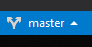

## Through Visual Studio
*Git Practice with Visual Studio 2019*

* Person-A
    * Clone the repository
    
      |||
      |-|-|
      |Open Vusial Studio 2019||
      |Click "Clone or checkout code" | |
      |Put this Repository Path "https://github.com/Fyzxs/GitKata" into the "Repository location" field | |
      |Customize "Local path" as desired.| |
      |Click "Clone" | |
    * Open The Solution
    
      |||
      |-|-|
      |Once the Clone is complete, Click on "Switch Views"||
      |Click on "GitPractice.sln"||
    * Create a Branch
    
      |||
      |-|-|
      |Click on "master" at the bottom right of the Visual Studio window||
      |Click on "New Branch"         ||
      |Enter a [UniqueNameNoSpaces]  ||
      |Have "Checkout Branch" checked||
      |Click "Create Branch"         ||
    * Write a failing test
    * Commit the change
    
      |||
      |-|-|
      Go to Team Explorer Tab                     |
      Go to the "Changes" view                    |
      Enter a Commit Message "First Failing Test" |
      Click "Commit All"                          |
    * Push changes to server
    
      |||
      |-|-|
      Go to the "Sync" view |
      Click either "Push"   |
* Person-B
    * Clone the repository
    
      |||
      |-|-|
      |Open Vusial Studio 2019||
      |Click "Clone or checkout code"                                                                 ||
      |Put this Repository Path "https://github.com/Fyzxs/GitKata" into the "Repository location" field||
      |Customize "Local path" as desired.                                                             ||
      |Click "Clone"                                                                                  ||
    * Open The Solution
    
      |||
      |-|-|
      |Once the Clone is complete, Click on "Switch Views"||
      |Click on "GitPractice.sln"||
    * Switch to the Branch
    
      |||
      |-|-|
      Click on "master" at the bottom right of the Visual Studio window|
      Click "Manage Branches"                                          |
      Expand "remotes/origin"                                          |
      Double Click on the created branch [UniqueNameNoSpaces]          |
    * Make the test pass
    * Commit the change
    
      |||
      |-|-|
      Go to Team Explorer Tab                     |
      Go to the "Changes" view                    |
      Enter a Commit Message "First Failing Test" |
      Click "Commit All"                          |
    * Push changes to server
    
      |||
      |-|-|
      Go to the "Sync" view|
      Click either "Push"  |

# From here it is the same for each participant

* Person-BOTH
    * Pull down the changes
    
      |||
      |-|-|
      Go to the "Sync" view |
      Click either "Pull"   |
    * Make the test pass
    * Commit the change
    
      |||
      |-|-|
      Go to Team Explorer Tab                     |
      Go to the "Changes" view                    |
      Enter a Commit Message "First Failing Test" |
      Click "Commit All"                          |
    * Write a failing test
    * Commit the change
    
      |||
      |-|-|
      Go to Team Explorer Tab                     |
      Go to the "Changes" view                    |
      Enter a Commit Message "First Failing Test" |
      Click "Commit All"                          |
    * Push changes to server
    
      |||
      |-|-|
      Go to the "Sync" view |
      Click either "Push"   |